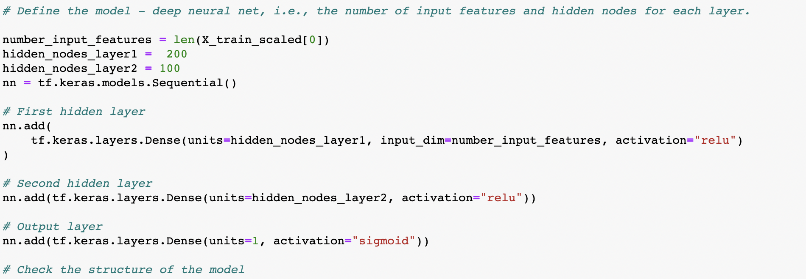

# Neural Network Charity Analysis

## Analysis Overview
For this project, the task was to utilize machine learning and neural networks to create a binary classifier capable of predicting whether applicants will be successful if funded by a non-profit foundation. The model was generated based on a database of information from 34,000 companies that were considered for funding. These classification features include information such as:
- <b>EIN and NAME</b> — Identification columns
- <b>APPLICATION_TYPE</b> — Alphabet Soup application type
- <b>AFFILIATION</b> — Affiliated sector of industry
- <b>CLASSIFICATION</b> — Government organization classification
- <b>USE_CASE</b> — Use case for funding
- <b>ORGANIZATION</b> — Organization type
- <b>STATUS</b> — Active status
- <b>INCOME_AMT</b> — Income classification
- <b>SPECIAL_CONSIDERATIONS</b> — Special consideration for application
- <b>ASK_AMT</b> — Funding amount requested
- <b>IS_SUCCESSFUL</b> — Was the money used effectively

The goal of the project was to determine whether a model based on this identifying informartion could predict the "success" outcome of a company's funding with an accuracy 75% or higher. Different strategies were used to improve the model's accuracy after the initial run. More details on the model structure is below. 

## Results
### Data Preprocessing 
Model Target Variable
- The target variable for this model was the "IS_SUCCESSFUL" column, which includes binary data of "yes" or "no" interpreted as either 1 or 0. This column indicates whether providing funding was successful or not

Feature Variables
- The feature variables utilized were mostly categorical data in the form of:
  - Application type
  - Affilication
  - Classification
  - Use Case
  - Organization
  - Status
  - Income classification

Non-Essential Variables
- The identification columns EIN and NAME were considered unnecessary for informing the model 

### Compiling, Training, and Evaluating the Model 
#### Initial Model
- For the inital attempt at running the neural network, the model used 2 hidden layers. In the first layer, there were 80 neurons, and in the second, 30 neurons.
- The activation functions used were Relu for the input layers and Sigmoid for the output layer.
- The accuracy of this original model was 68%

#### Optimization Attempt 1
- For the first attempt to improve the model's accuracy to reach a rate at or above 75%, I incorporated a third hidden layer and adjusted the number of neurons to 100 for layer 1, 80 for layer 2, and 50 for layer 3. 
- The activation functions remained the same as the initial model.
- The accuracy of this first optimization attempt was only 50%, leading to the conclusion that adding an additional hidden layer was not beneficial to the model's ability to interpret and classify the data.

#### Optimization Attempt 2
- For the second attempt to improve the model's accuracy, I removed the third hidden layer and went back to 2. Within the 2 hidden layers, I adjusted the number of neurons to 200 and 100 respectively.
- The activation functions remained the same as the initial model. 
- The accuracy of this second optimization attempt was 55%. 
- While this improved the accuracy, it was still worse than the initial model. This led to the conclusion that increasing the number of layers and variables did not help. Instead, the issue could be due to the type of activation functions used, the type of machine learning model used, or the dataset itself.

<b>** Note, I did attempt changing the activation function for the output layer to "Tanh" instead of Sigmoid and found that it did not improve the model. Based on this, I dedcided to focus my next attempts on changing the type of machine learning model as well as simplifying the dataset instead of focusing on changing the activation functions within the deep learning model.</b>

#### Optimization Attempt 3
- For the third attempt to improve the model's accuracy, I decided to try a different machine learning model altogether. The deep neural network model was not leading to a high level of accuracy, so I chose to try a simpler model with a Random Forest. 
- I utilized 128 estimators in the Random Forest Model, a fairly large number of decision trees, to mirror the robust layers in the neural network model.
- The accuracy of this model was 71.5%
- The conclusion here is that simplifying the model improved the accuracy, but it still did not help us reach the 75% accuracy threshold.

#### Optimization Attempt 4
- For this fourth and final attempt to improve the model's accuracy, I decided to reduce the number of features influencing the model to simplify it further and reduce potential noise or outlier data. I eliminated columns that I felt were not essential to the success factor of a company's funding. The code for removing additional columns can be viewed here:

- The accuracy of this model was 73.3%
- This model got us very close to the threshold of 75%. The conclusion here is that a simplified data set in addition to a simplified machine learning model provided a better outcome than a more complex deep neural network. 

## Summary
- The results of the optimization attempts revealed that adding additional hidden layers as well as additional neurons did not improve the model's accuracy
- Changing the activation function of the output layer to "Tanh" instead of "Sigmoid" also did not help.
- These results informed my decision to try a simplified machine learning model, and I switched to utilizing a Random Forest Tree. 
- While the number of columns within the original dataset (more than 40) would suggest that a deep learning model would be most beneficial for interpreting such a robust dataset, the Random Forest model is similiar to neural networks in its ability to generate many, smaller decision trees to interpret the data. 
- The result of the Random Forest model showed an improvement in performance to greater than 70%.
- Since this was still below the 75% threshold for accuracy, the hypothesis was that the dataset itself required further manipulation in order to generate highly accurate prediction model. 
- Removing additional columns from the dataset to simplify the model's input features increased the model's accuracy to 73.3%
- Based on this exercise, the biggest takeaway is that a simpler model may sometimes be better than the most complex option depending on the dataset. To further increase performance, I believe that further manipulation of the dataset is needed.
  - Further clustering into a smaller number of bins for features with greater than 5 unique values could be helpful 
  - A dimensionality reduction exercise could be beneficial for reducing the number of features necessary to support the model 

